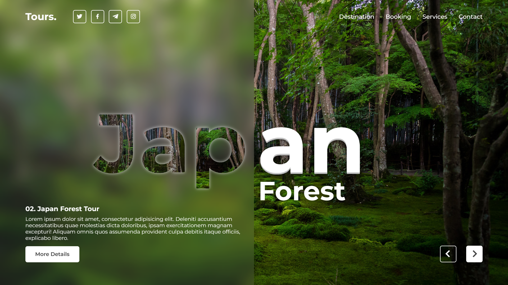
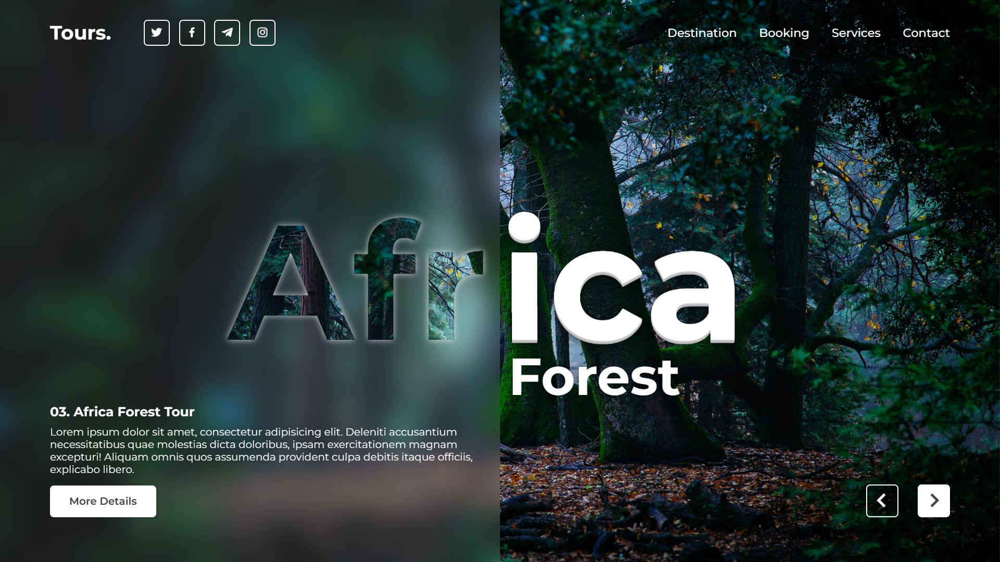

# Travel Website Landing Page

<figure>
  <figcaption>Website View (on desktop screen)</figcaption>
  
</figure>
 
<figure>
  <figcaption>Screenshot 1 (on desktop screen)</figcaption>
  
</figure>

<figure>
  <figcaption>Screenshot 2 (on desktop screen)</figcaption>
  
</figure>

<figure>
  <figcaption>Screenshot 3 (on desktop screen)</figcaption>
  
</figure>

<figure>
  <figcaption>Screenshot 4 (on desktop screen)</figcaption>
  
</figure>

<figure>
  <figcaption>Screenshot 5 (on desktop screen)</figcaption>
  
</figure>
